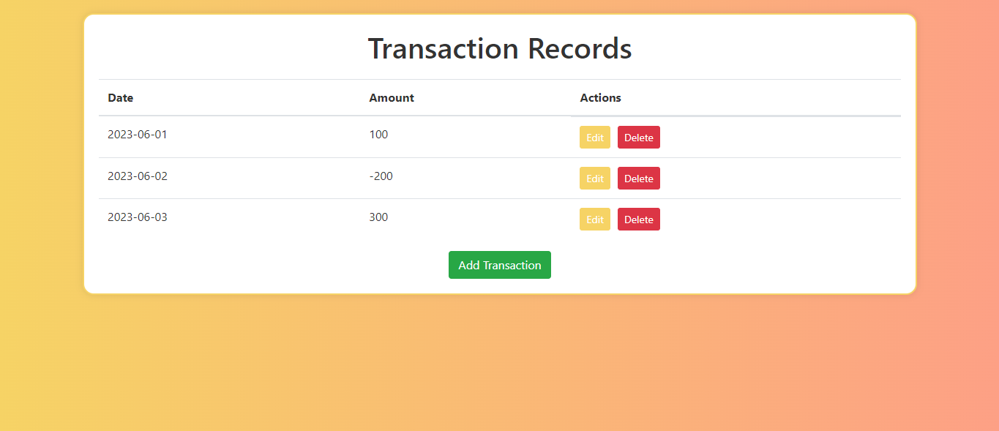
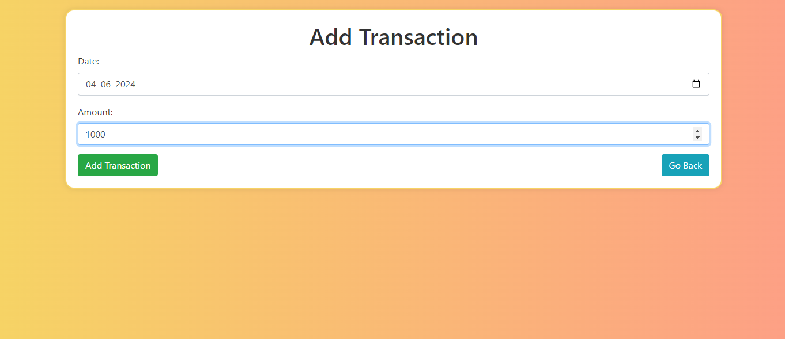
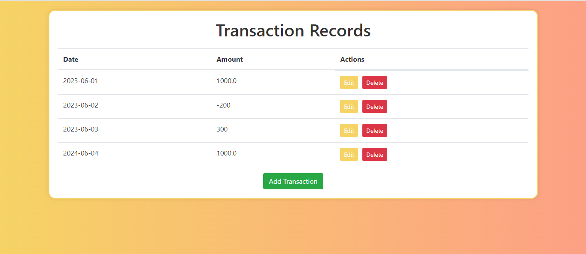
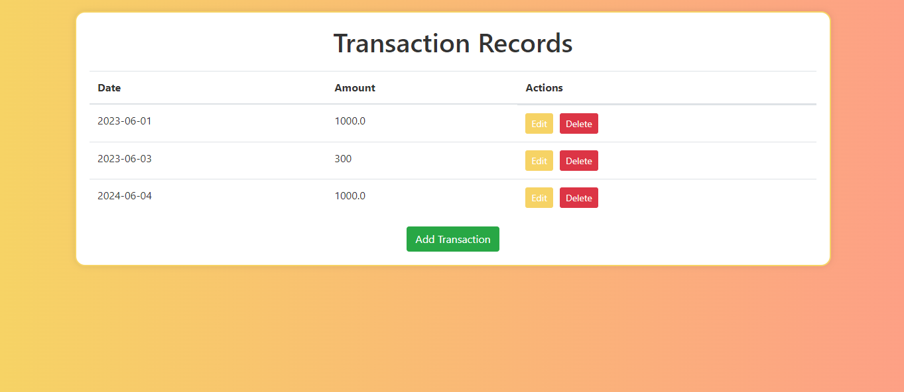

<p align="center">
    <a href="https://github.com/Anirbanrohan/Transactions_processing">
      
      <h3 align="center">Transactions Processing</h3>
    </a>
  </p>
  <p align="center"><i>You'll get to know what all technologies a webpage is using.</i></p>
  <div align="center">
    <a href="https://github.com/Anirbanrohan/Transactions_processing/stargazers">
    </a>
  <a href="https://github.com/Anirbanrohan/Transactions_processing/network/members">
  </a>
  <a href="https://github.com/Anirbanrohan/Transactions_processing/issues">
  </a>
  </div>
  <br>
  
  This repo aims to keep all the record of your transactions and also adding,updating,deleting your transactions.
  
  
  <details open="open">
    <summary><h2 style="display: inline-block">Contents</h2></summary>
    <ol>
      <li>
        <a href="#about-the-project">About The Project</a>
        <ul>
          <li><a href="#built-with">Built With</a></li>
        </ul>
      </li>
      <li>
        <a href="#getting-started">Getting Started</a>
        <ul>
          <li><a href="#installation">Installation</a></li>
        </ul>
      </li>
      <li><a href="#contact">Contact</a></li>
    </ol>
  </details>
  
  
  ## About The Project
  
    The application has three different web pages. The first one displays all the recorded transactions. This page is called Transaction Records and displays all the transactions entries created in the system. This page also gives an option to Edit and Delete the available entries. The option of adding an entry is also available on this page. The second page is Add Transaction which is used when the user chooses to add the entry on the previous page. The user adds the Date and Amount values for the new entry. The third page is Edit Transaction which is user navigated to upon clicking the edit entry option. On this page also, the date and amount are accepted as entries; however, these entries are then reflected against the ID that was being edited
  
  ### Screenshot 1
  
  <h4>This is the first page which displays all the recorder transactions.</h4>
  
  
  ### Screenshot 2
  
  <h4>This is the secong page where you can add transactions.</h4>
  
  
  ### Screenshot 3
  
  <h4>See the transaction is added</h4>
  
  
  ### Screenshot 4
  
  <h4>This is the third page where you can edit the transactions.</h4>
  
  
  ### Screenshot 5
  
  <h4>As you can see the amount of the transaction dated 2023-06-01 is changes from 100 to 1000.</h4>
  
  ### Screenshot 6
  
  <h4>The second transaction is deleted on clicking the delete button.</h4>
  
  ### Built With
  
  * Python
  * Requests
  * Flask
  * HTML
  
  
  
  ## Getting Started
  
  To get a local copy up and running follow these simple steps.
  
  
  
  ### Installation
  
  1. Clone the repo
  
     ```sh
     git clone https://github.com/Anirbanrohan/Transactions_processing.git
     ```
     
  
  
  ## Contact
  
  Anirban Halder
  
  LinkedIn: https://www.linkedin.com/in/anirban-halder-b252a7258/
  
  
  
  
  
  ## Show your support
  
  Give a ⭐️ if you liked this project!
